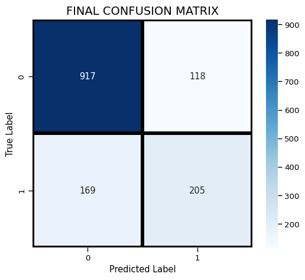

# 🔥 Customer Churn Prediction


[](https://colab.research.google.com/github/Retro099/ML-Projects/blob/main/Customer_Churn_Prediction/notebooks/Customer_Churn_Real.ipynb)

---

## 🧠 Project Overview
End-to-end churn prediction model using bank customer data.  
Identifies high-risk customers for targeted retention campaigns.

**Final Model**: Logistic Regression Pipeline (full preprocessing + classification)  
**Dataset**: ~10,000 anonymized records  
**Key Metrics**: Accuracy ~82%, Recall ~57% (prioritizes catching actual churners)

**Live Demo:** [Streamlit App](https://ml-projects-njqzlxkffdz9kzztmaszak.streamlit.app/)

## 📊 Results Summary

| Metric    | Value | Notes                          |
|-----------|-------|--------------------------------|
| Accuracy  | 0.82  | Overall correctness            |
| Recall    | 0.57  | Churn detection rate (priority)|
| Precision | 0.65  | Trust in positive predictions  |
| F1 Score  | 0.60  | Balance precision & recall     |

Full details & column info: [`artifacts/manifest.json`](./artifacts/manifest.json)

## 🖼️ Visuals


(All plots & SHAP visuals saved in `assets/` folder)

## 🧮 Business Insights
- Strongest churn drivers: **high monthly charges**, **short tenure**, **low balance**  
- Recommended focus: Customers **aged 30–45** with **1–3 products**  
- Action: Proactive offers on top ~20% predicted risk → reduces revenue loss efficiently

## ▶️ How to Run
**Colab (recommended)**: Click badge above

**Local**:
```bash
git clone https://github.com/Retro099/ML-Projects.git
cd ML-Projects/Customer_Churn_Prediction
pip install -r requirements.txt
jupyter notebook notebooks/Customer_Churn_Real.ipynb
