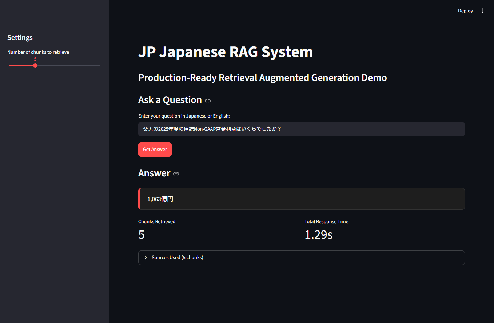

**✅ Here’s the complete rewritten README** for your Japanese RAG project, following the exact structure we discussed (optimized for both India and Japan markets).

You can copy and paste this directly into your `README.md`.

---

```markdown
# Japanese RAG Production System

**Production-Ready Retrieval-Augmented Generation Pipeline for Japanese Documents**

A modular, evaluation-aware RAG system focused on Japanese text, featuring clean architecture, real RAGAS evaluation, FastAPI backend, and a professional Streamlit interface.

---

## 1. Project Overview

This project is a mid-level production-oriented RAG system designed for Japanese documents. It was built to demonstrate practical engineering skills relevant to the 2026 job market in both India and Japan.

**Goal:**  
Build a clean, modular, and measurable RAG pipeline that properly handles Japanese text characteristics (no spaces, long sentences, compound words) while following production engineering practices.

**Why this project matters:**

- Japanese document handling is still a real differentiator for Japan-targeted roles.
- Many portfolios stop at basic RAG tutorials. This project goes further with evaluation, API design, and production thinking.

---

## 2. Key Features

- **Japanese-aware chunking** with configurable size and overlap
- **bge-m3 embeddings** optimized for multilingual (including Japanese) retrieval
- **Real RAGAS evaluation** using actual system outputs (not dummy data)
- **API-first architecture** (FastAPI backend + Streamlit frontend)
- **Professional Streamlit UI** with latency metrics, grounding status, and source citations
- **Docker-ready** with `Dockerfile` and `docker-compose.yml`
- Modular codebase following clean separation of concerns

---

## 3. Tech Stack

| Component        | Technology                     | Reason                                             |
| ---------------- | ------------------------------ | -------------------------------------------------- |
| Embeddings       | BAAI/bge-m3                    | Strong multilingual performance, good for Japanese |
| Vector Database  | ChromaDB                       | Lightweight and easy to use for local development  |
| LLM              | Groq (llama-3.3-70b-versatile) | Fast inference and good Japanese capability        |
| Backend          | FastAPI + Uvicorn              | Clean API layer and production readiness           |
| Frontend         | Streamlit                      | Fast interactive demo                              |
| Evaluation       | RAGAS                          | Industry-standard RAG metrics                      |
| Containerization | Docker + docker-compose        | Production deployment support                      |

---

## 4. Architecture & Design Decisions
```

PDF Documents
↓
Document Ingestion (PyMuPDF)
↓
Japanese-aware Chunking
↓
bge-m3 Embeddings → ChromaDB
↓
Retriever (Top-K)
↓
Generator (Groq + Improved Prompt)
↓
FastAPI Backend ←→ Streamlit Frontend


**Key Design Decisions:**

- **Modular structure** (`src/` folder) so each component can be tested and improved independently.
- **API-first approach**: Streamlit does not contain business logic. It only calls the FastAPI backend.
- **Real evaluation**: Used actual outputs from the system for RAGAS instead of synthetic data.
- **Prompt engineering**: Multiple iterations were done to improve answer relevancy while keeping faithfulness high.
- **Docker support**: Prepared for production environments even though local testing was limited by hardware constraints.

---

## 5. Screenshots & Demo

> **Live Demo:** Run locally using the instructions below
> (Streamlit UI + FastAPI backend)


**Main Interface:**
- Clean dark theme
- Latency metrics (Retrieval Time + Generation Time)
- Grounding status indicator
- Expandable source citations

---

## 6. Setup & Installation

### Prerequisites
- Python 3.10+
- Groq API Key

### Local Development (Recommended)

```bash
# 1. Clone the repository
git clone https://github.com/your-username/Japanese_RAG_Production.git
cd Japanese_RAG_Production
```

# 2. Create virtual environment
python -m venv venv
source venv/bin/activate        # Windows: .\venv\Scripts\Activate.ps1

# 3. Install dependencies
pip install -r requirements.txt

# 4. Create .env file
cp .env.example .env
# Add your GROQ_API_KEY inside .env

# 5. Start FastAPI backend
python api.py

# 6. In another terminal, start Streamlit
streamlit run app/streamlit_app.py

### Production Deployment (Docker)

```bash
# 1. Create .env file
cp .env.example .env
# Add your GROQ_API_KEY

# 2. Build and run
docker-compose up --build
```

This will start:

- FastAPI backend → `http://localhost:8000`
- Streamlit frontend → `http://localhost:8501`

---

## 7. Evaluation Results

The system was evaluated using **real test cases** extracted from actual interactions with the pipeline.

### RAGAS Scores

| Metric               | Score      | Assessment       |
| -------------------- | ---------- | ---------------- |
| **Faithfulness**     | **0.9643** | Excellent        |
| **Answer Relevancy** | **0.7633** | Good (Mid-level) |

**Interpretation:**

- **Faithfulness (0.96)**: Answers are highly grounded in the retrieved context with very low hallucination.
- **Answer Relevancy (0.76)**: Answers are reasonably relevant. Further gains are possible through continued prompt optimization and better chunking.

These scores represent a **solid mid-level result**, especially considering the evaluation was done on real system outputs.

---

## 8. Limitations & Future Improvements

### Current Limitations

- Embedding is recomputed on every application restart (slow on low-resource machines)
- Answer relevancy can still be improved for broader questions
- Docker setup was prepared for production but not fully tested in a high-resource environment due to local hardware constraints
- Limited number of documents in the current demo

### Planned Improvements

- Persistent vector store to avoid re-embedding
- Implementation of re-ranking
- Expansion of RAGAS evaluation with more diverse test cases
- Full Docker deployment testing and CI/CD integration
- Further prompt and chunk quality improvements

---

## 9. Project Structure

```
Japanese_RAG_Production/
├── app/
│   └── streamlit_app.py
├── src/
│   ├── config.py
│   ├── ingestion.py
│   ├── chunking.py
│   ├── embedding_store.py
│   ├── retrieval.py
│   ├── generation.py
│   └── evaluation.py
├── data/
│   └── sample/
├── evaluation/
│   └── ragas_evaluation.ipynb
├── api.py
├── Dockerfile
├── docker-compose.yml
├── .env.example
├── requirements.txt
└── README.md
```

---

## 10. Japanese Summary (日本就業に向けた技術的サマリー)

本プロジェクトでは、日本語文書を対象とした実用的なRAGシステムを構築しました。

### 技術的アプローチ

- `bge-m3`埋め込みモデルと日本語を考慮したチャンキング戦略を採用
- モジュール設計により保守性と拡張性を重視
- 実際のシステム出力を使用したRAGAS評価を実施（Faithfulness: 0.9643 / Answer Relevancy: 0.7633）
- FastAPIによるバックエンドとStreamlitによるフロントエンドを分離したAPI-firstアーキテクチャ

### 現在の成果と課題

- 回答の根拠性（Faithfulness）は非常に高く、幻覚の抑制に成功
- 回答の関連性（Answer Relevancy）は改善の余地があり、プロンプト最適化が今後の課題
- ローカル環境の制約によりDockerでの完全な動作確認は限定的だったが、本番展開用の設定ファイルは整備済み

### 今後の展望

- Dockerを活用した本番環境への展開
- RAGAS評価の自動化
- 回答品質のさらなる向上（Re-ranking、プロンプト改善など）

本プロジェクトは、日本語文書を扱う実務的なRAGシステムの構築経験と、評価・API設計といった中級レベルのエンジニアリングスキルを証明するものです。

---

## Lessons Learned

- Real evaluation is significantly more valuable than dummy data.
- Prompt engineering has a large impact on Answer Relevancy.
- Separating frontend and backend (even in a small project) greatly improves code quality and interview discussion points.
- Being honest about limitations is more professional than overclaiming.

---

**Note:** This project was developed with limited local computing resources. The core pipeline, evaluation, and API layer were fully implemented and tested. Docker configuration is provided for production environments with sufficient resources.
